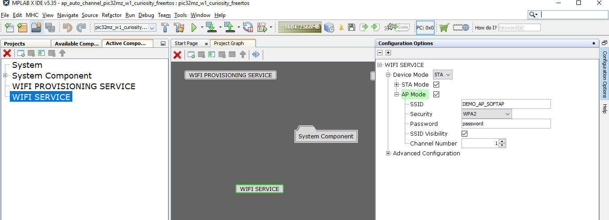
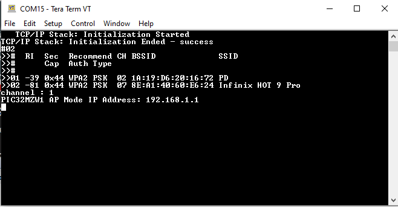

# Wi-Fi AP Mode Auto Channel Selection 

This example application acts as a Wi-Fi AP , selecting the channel with less traffic.

## Description

This application demonstrates how a user can enable PIC32MZW1 device to act as an AP and to provide a logic so that AP select a channel which is having less traffic . The default application will try to enable device as an AP "DEMO_AP_SOFTAP" with WPA2 security and password as a "password".

## Downloading and building the application

To download or clone this application from Github, go to the [top level of the repository](https://github.com/MicrochipTech/PIC32MZW1_Projects)

Path of the application within the repository is **https://github.com/MicrochipTech/PIC32MZW1_Projects/tree/main/ap_auto_channel** .

To build the application, refer to the following table and open the project using its IDE.

| Project Name      | Description                                    |
| ----------------- | ---------------------------------------------- |
| ap_auto_channel_pic32mz_w1_curiosity_freertos.X | MPLABX project for PIC32MZ W1 Curiosity Board |
|||

## Setting up PIC32MZ W1 Curiosity Board

- Connect the Debug USB port on the board to the computer using a micro USB cable
- On the GPIO Header (J207), connect U1RX (PIN 13) and U1TX (PIN 23) to TX and RX pin of any USB to UART converter
- Home AP (Wi-Fi Access Point with internet connection)

## Running the Application

1. Open the project and launch Harmony3 configurator.
2.	Configure home AP credentials for STA Mode.

    

3.	Save configurations and generate code via MHC 
4.	Build and program the generated code into the hardware using its IDE
5. Open the Terminal application (Ex.:Tera term) on the computer
6. Connect to the "USB to UART" COM port and configure the serial settings as follows:
    - Baud : 115200
    - Data : 8 Bits
    - Parity : None
    - Stop : 1 Bit
    - Flow Control : None

7.	The device will be in AP mmode and print the IP address and channel.

    

