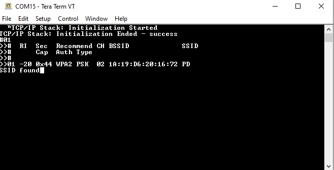

# Directed Active Scan 

> Please refer to [Directed active scan in PIC32MZW1/WFI32 device](https://microchipsupport.force.com/s/article/Directed-active-scan-in-PIC32MZW1-WFI32-device) for more details about the implementation of this project

This example application acts as a Wi-Fi Station(STA) and initiate a directed active scan to find user defined SSID

## Description

This application demonstrates how a user can initiate a directed scan. The user would need to configure the Home AP SSID name. The Wi-Fi service will initiate the scan and search for the SSID .The default application will try to search an AP with SSID named "DEMO_AP" and show the result ( like "SSID found" or "SSID not found").

## Downloading and building the application

To download or clone this application from Github, go to the [top level of the repository](https://github.com/MicrochipTech/PIC32MZW1_Projects)

Path of the application within the repository is **https://github.com/MicrochipTech/PIC32MZW1_Projects/tree/main/directed_active_scan** .

To build the application, refer to the following table and open the project using its IDE.

| Project Name      | Description                                    |
| ----------------- | ---------------------------------------------- |
| directed_active_scan_pic32mz_w1_curiosity_freertos.X | MPLABX project for PIC32MZ W1 Curiosity Board |
|||

## Setting up PIC32MZ W1 Curiosity Board

- Connect the Debug USB port on the board to the computer using a micro USB cable
- On the GPIO Header (J207), connect U1RX (PIN 13) and U1TX (PIN 23) to TX and RX pin of any USB to UART converter
- Home AP (Wi-Fi Access Point with internet connection)

## Running the Application

1. Open the project and launch Harmony3 configurator.
2. configure STA Mode.

    

3.	Save configurations and generate code via MHC 
4.	Build and program the generated code into the hardware using its IDE
5. Open the Terminal application (Ex.:Tera term) on the computer
6. Connect to the "USB to UART" COM port and configure the serial settings as follows:
    - Baud : 115200
    - Data : 8 Bits
    - Parity : None
    - Stop : 1 Bit
    - Flow Control : None

7.	Device will show the result (like "SSID found" or "SSID not found")

    

