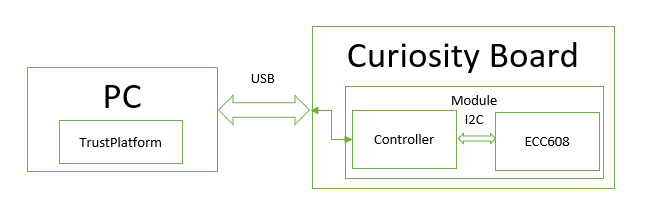
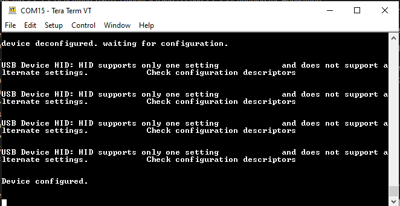
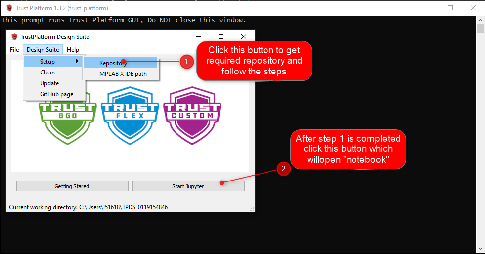
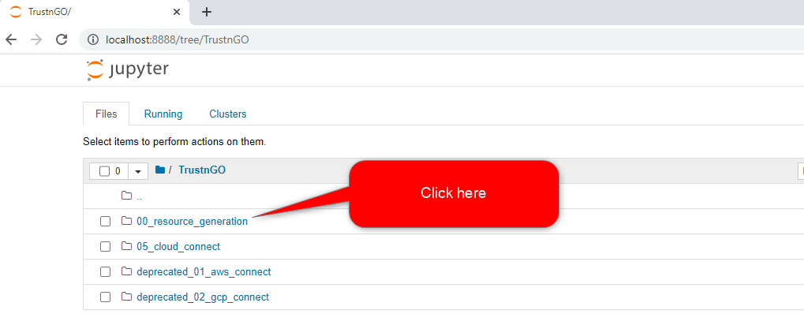
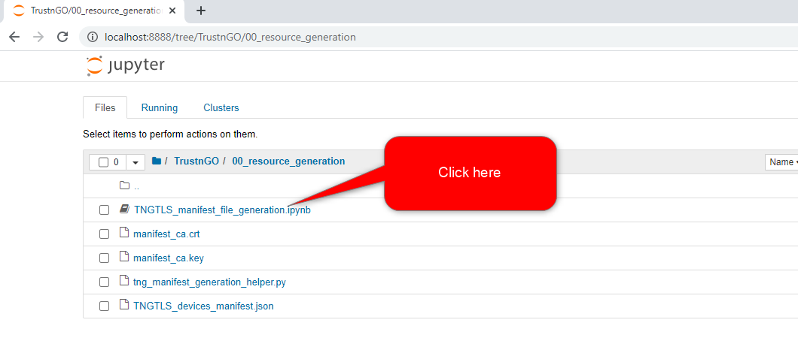
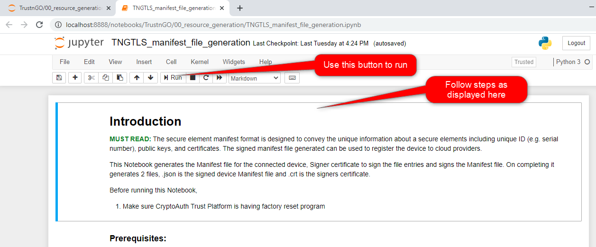
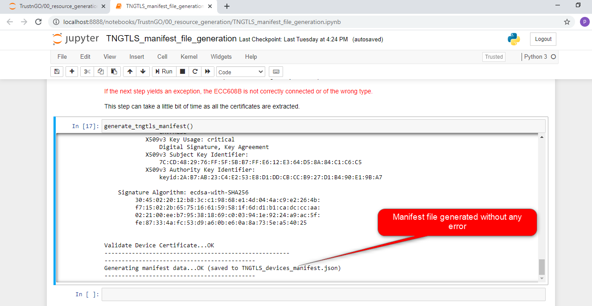
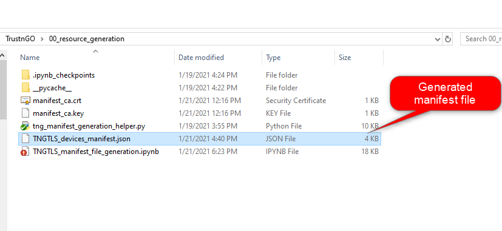
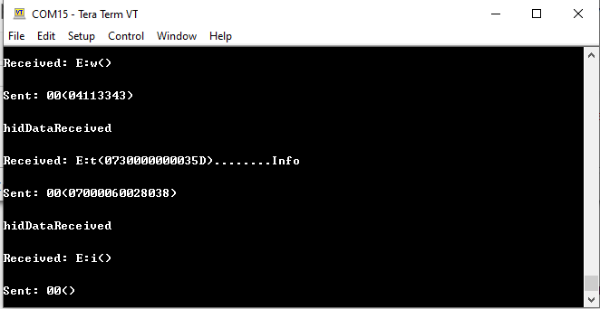

# Fetching manifest file from the WFI32 module Trush & Go (TNG) .

This application implements the USB HID kit protocol bridge required to fetch the manifest file from the TNG TLS chip on the WFI32 module. 

## Description

This application implements the USB HID kit protocol bridge required to fetch the manifest file from the TNG TLS chip on the WFI32 module. USB HID acts as communication protocol between PIC32MZW1 and PC, where 'TrustPlatform Design Suite' is installed, to extract the required information from ECC608 (connected via I2C to the PIC32MZW1) and generate the manifest file.   

## Downloading and building the application

To download or clone this application from Github, go to the [link](https://github.com/MicrochipTech/PIC32MZW1_Projects/tree/main/)

To build the application, refer to the following table and open the project using its IDE.

| Project Name      | Description                                    |
| ----------------- | ---------------------------------------------- |
| kitprotocol.X     | MPLABX project for PIC32MZ W1 Curiosity Board |
|||

## Setting up PIC32MZ W1 Curiosity Board & Tools

- Connect the Debug USB port on the board to the computer using a micro USB cable
- On the GPIO Header (J207), connect U1RX (PIN 13) and U1TX (PIN 23) to TX and RX pin of any USB to UART converter
- Install [TrustPlatform](https://microchipdeveloper.com/authentication:trust-platform) on host PC.

## Running the Application

1.  Open the project "kitprotocol".
2.	Generate code using MHC.
3.  Build and Program the image into target using IDE.

4.  Optionally, connect to a USB to UART converter to UART1 and Open a Terminal application (Ex.:Tera term) on the computer. Configure the serial settings as follows:
    - Baud : 115200
    - Data : 8 Bits
    - Parity : None
    - Stop : 1 Bit
    - Flow Control : None

5.  User may see messages on opened Terminal, as shown in below image :

    
6.  Open "Trust Platform" and follow steps, as shown in below image:

    

7.  Click on "TrustnGo" on opened page in the browser:

    

    
8.  Click on "resource_generation" on opened page of the browser:

       

9.  Follow step as shown in below image:

    

10.  Click "Run" button and follow the instructions, as displayed on page , till manifest file is generated:
       

11.  User can see message as shown in below image, if manifest file is generated without any error. 
       

12.  Generated Manifest file can be found in local folder:
      

13.  Some of the expected message on UART terminal while generating Manifest file :
      

## Using the kit protocol with TrustFLEX

The kit protocol implemented in this project can also be used to work with other trust platform modules such as the TrustFLEX, with minor modifications. 
External trust platform modules can be connected to the WFI32E01 module using `I2C1`. The easiest way to get started would be to use a [ATECC608B Trust](https://www.microchip.com/developmenttools/ProductDetails/DT100104) attached to the mikroBUS header of the WFI32 curiosity board. 

To update the kit-protocol firmware to use `I2C1` instead of the default `I2C2` (connected to the onboard TnG module), change `HAL_I2C_I2C2` defined in `hal_harmony_i2c.h` file of the kit protocol project to `HAL_I2C_I2C1`. Once updated kit protocol is compiled and flashed into the development board, You can use the TrustFLEX resource generation notebook of TrustPlatform design suite to configure the device.
