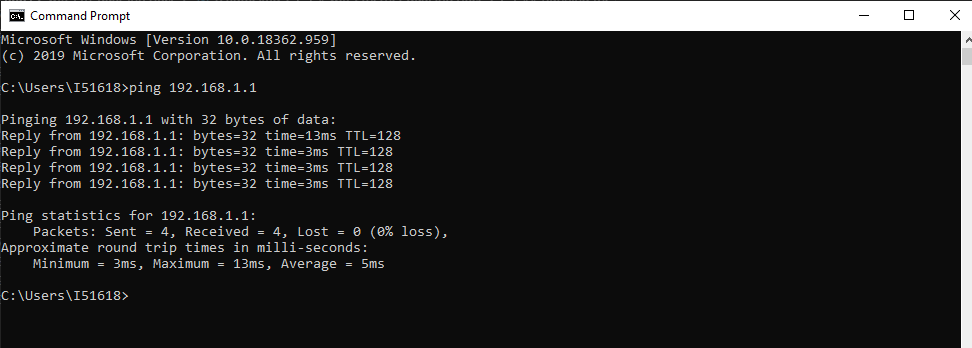

# Wi-Fi - Ethernet Routing Example

This example application is enabled  with both wifi and ethernet interfaces with 2 DHCP servers. Wi-Fi interface will act as a softAp. The Wi-Fi and ethernet interfaces are configured to be in different subnets and the firmware will enable routing between these subnets. 

## Description

This application demonstrates how a user can enable both wi-fi and ethernet interface along with the routing feature. The system shall run in freertos mode, and the Wi-Fi interface shall come up in AP mode.

To build the application, refer to the following table and open the project using its IDE.

| Project Name      | Description                                    |
| ----------------- | ---------------------------------------------- |
| pic32mz_w1_curiosity_freertos.X | MPLABX project for PIC32MZ W1 Curiosity Board |
|||

## Setting up PIC32MZ W1 Curiosity Board

- Connect the Debug USB port on the board to the computer using a micro USB cable
- On the GPIO Header (J207), connect U1RX (PIN 13) and U1TX (PIN 23) to TX and RX pin of any USB to UART converter
- Laptop (connect the ethernet cable between laptop and curiosity board)
- Mobile (wifi-interface)

## Running the Application

1. Open the project and launch Harmony3 configurator .
2.	Configure credentials for AP Mode.

3.	Save configurations and generate code via MHC. 
4.	Build and program the generated code into the hardware using its IDE
5. Open the Terminal application (Ex.:Tera term) on the computer
6. Connect to the "USB to UART" COM port and configure the serial settings as follows:
    - Baud : 115200
    - Data : 8 Bits
    - Parity : None
    - Stop : 1 Bit
    - Flow Control : None

7.	The Board will come up in AP mode: 

8.	Connect your laptop to the ethernet interface of the WFI32 device.Make a note of the IP address getting assigned to the laptop.

9. Connect a smartphone or a laptop to the wifi interface of the WFI32 device. Make a note of the IP address getting assigned to the connected device.

10. Now verify the status of the wifi and ethernet interfaces of the WFI32 device by issuing a "netinfo" command.

9.  User can verify the connectivty status by pinging pic32mzw1 from laptop or mobile to respective interface ( ethernet or wifi ) :

10. Now user can verify the routing feature by pinging the devices connected in different subnets.

