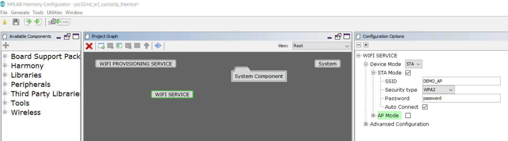

# Wi-Fi Connection time (WPA2 mode) 

This example can be used to measure time taken to establish connection when connecting to a Wi-Fi access point with WPA2 security.

## Description

This application demonstrates how a user can connect to the Home AP. The user would need to configure the Home AP credentials (like SSID and security items). The Wi-Fi service will use the credentials to connect to the Home AP and acquire an IP address.The default application will try to establish a connection to AP "DEMO_AP" with WPA2 security and password as a "password".

Time taken to establish connection will be printed in the console once the data is available. 

## Downloading and building the application

To download or clone this application from Github, go to the [top level of the repository](https://github.com/Microchip-MPLAB-Harmony/wireless)

Path of the application within the repository is **apps/wifi_sta/firmware** .

To build the application, refer to the following table and open the project using its IDE.

| Project Name      | Description                                    |
| ----------------- | ---------------------------------------------- |
| pic32mz_w1_curiosity_freertos.X | MPLABX project for PIC32MZ W1 Curiosity Board |
|||

## Setting up PIC32MZ W1 Curiosity Board

- Connect the Debug USB port on the board to the computer using a micro USB cable
- On the GPIO Header (J207), connect U1RX (PIN 13) and U1TX (PIN 23) to TX and RX pin of any USB to UART converter
- Home AP (Wi-Fi Access Point with internet connection)

## Running the Application

1. Open the project and launch Harmony3 configurator.
2.	Configure home AP credentials for STA Mode.

    

3.	Save configurations and generate code via MHC 
4.	Build and program the generated code into the hardware using its IDE
5. Open the Terminal application (Ex.:Tera term) on the computer
6. Connect to the "USB to UART" COM port and configure the serial settings as follows:
    - Baud : 115200
    - Data : 8 Bits
    - Parity : None
    - Stop : 1 Bit
    - Flow Control : None

7.	The device will connect to the Home AP and print the IP address obtained.

    

8.	From the DUT(Device Under Test), user can ping the Gateway IP address.

    

9. Time taken to establish connection will be printed in the console.